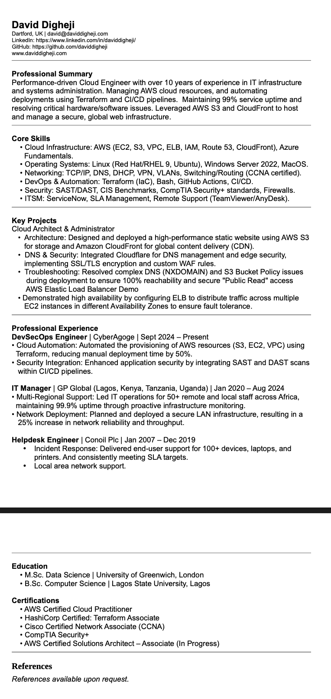

#   Fronteend Technical Specification

Create a static website that server an html resume.

##  Resume Format Considerations 

I live in Uk, and resume does not include some personal identifiable information  (NIF) examples: photo, age, religion, GPA


In UK, we use Reverse Chronologial CV
I will be use Reverse chronological template format (//www.wozber.com/en-gb/cv-examples/information-technology/cloud-engineer-cv-example) as the basis for my resume

 ### Reverse Chronolocal resume

I am good using HTML, but will use GenAI do the heavy lifting and generating out html and CSS and from there i will customise the code.


Prompt to ChatGPT 5.4:

```text 
Convert this resume format into html.
Please don't use a css framework.
Please use the leease amount of css tags
```

Images provided to prompt to LLM:


This is the [generated html code](./docs/240326-resume-minimal) which I intend to modify.

